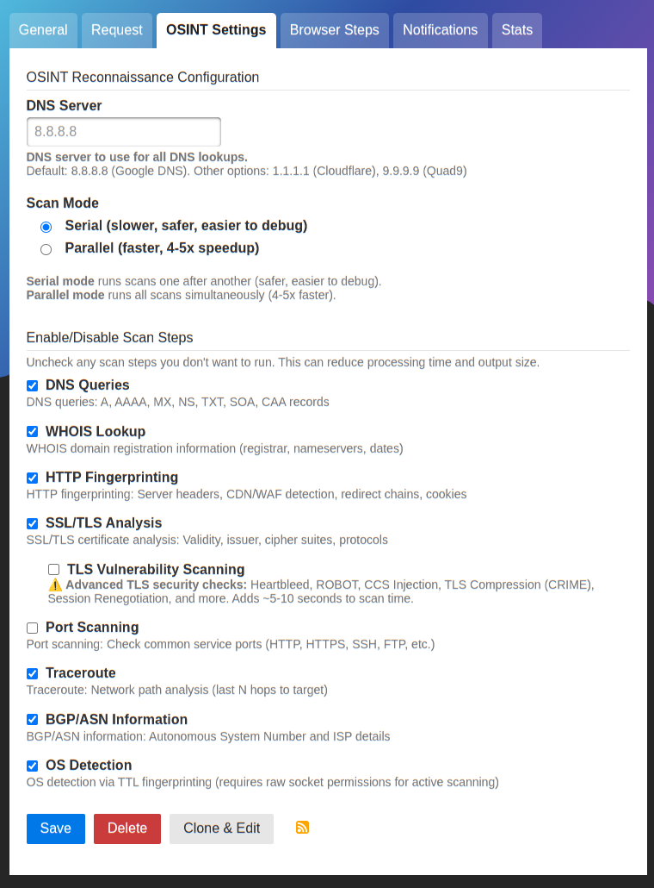
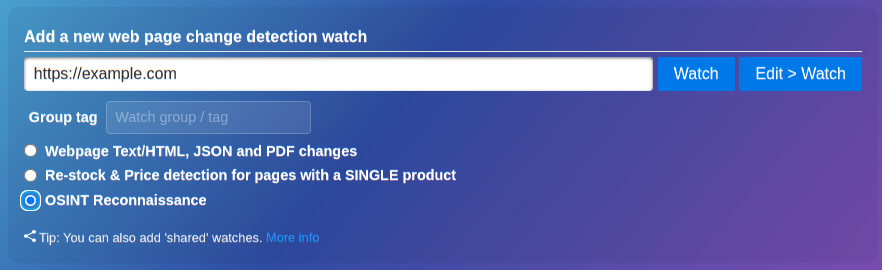
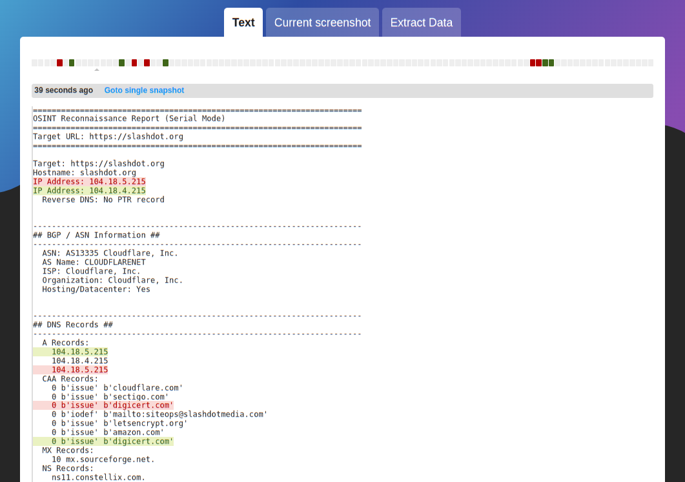

# 🔍 OSINT Reconnaissance Changedetection.io Processor Agent

> **Comprehensive network intelligence and security monitoring leveraging changedetection.io**

**Monitor your infrastructure for unexpected changes.** Detect unauthorized modifications to SSL/TLS certificates, DNS records, BGP routing, open ports, WHOIS registration details, HTTP security headers, and TLS cipher configurations. Perfect for security teams, DevOps engineers, SRE teams, and OSINT practitioners who need continuous visibility into their infrastructure's security posture. Get instant notifications when certificates are about to expire, DNS records change, new vulnerabilities appear, or network paths are rerouted—before they become security incidents or outages.

Use the existing text filters built into [changedetection.io](https://github.com/dgtlmoon/changedetection.io) to trim out information you don't need and keep only what's relevant to you. Easily connect change alerts to Discord, Slack, email, and 90+ other notification backends, leveraging the awesomeness of changedetection.io's powerful notification system.

## ✨ Features

**Network Intelligence**
- DNS Records (A, AAAA, MX, NS, TXT, SOA, CAA)
- WHOIS Lookup (registration, nameservers, expiry)
- BGP/ASN Info (ISP, network ownership)
- Traceroute (network path analysis)
- MAC Address (vendor identification via IEEE OUI)

**Security Analysis**
- SSL/TLS Certificates (subject, issuer, validity, SANs)
- Cipher Suites (SSL 2.0 → TLS 1.3)
- Vulnerability Scanning (Heartbleed, ROBOT, CCS Injection, CRIME, etc.)
- HTTP Security Headers (HSTS)

**Application Layer**
- HTTP Fingerprinting (headers, cookies, redirects, CDN/WAF detection)
- Port Scanning (common service ports)
- OS Detection (TTL-based fingerprinting)

**Performance**
- Parallel Mode (4-5x faster scans)
- Serial Mode (safer, easier to debug)
- Configurable modules (enable/disable any scan)
- Real-time status updates

_Example settings_



#### Pro-tips:
- Use the _"Only trigger when unique lines appear in all history"_ text filter setting to limit to new events 
that has not been seen before (ignores text moving around like IP addresses in a pool).


## 📦 Installation

This processor agent is only used with changedetection.io

### `docker-compose.yml` based installations.

Uncomment and/or add this package to the `EXTRA_PACKAGES` var in `docker-compose.yml` of your changedetection.io installation.

```
  environment:                                                                                                                                                                                                      
    - EXTRA_PACKAGES=changedetection.io-osint        
```

`EXTRA_PACKAGES` is a space-separated list of extra packages to add at startup time to changedetection.io.

### Standalone pip3 installations.

```bash
pip3 install changedetection.io-osint
```

**⚠️ Note:** Requires `cryptography>=43,<45` for sslyze compatibility.

**⚠️ Note note!:** Does not actually use any proxy settings for now (runs from your changedetection.io network source).

## 🚀 Quick Start


1. Create a watch with URL: `https://example.com`
2. Select processor: **OSINT Reconnaissance**
3. Configure OSINT Settings (optional):
   - DNS Server: 8.8.8.8 (or 1.1.1.1, 9.9.9.9)
   - Scan Mode: Serial or Parallel
   - Enable/Disable modules as needed

## 📊 Sample Output




```
Target: https://example.com
Hostname: example.com
IP Address: 93.184.216.34
Reverse DNS: example.com.

=== BGP / ASN Information ===
ASN: 15133
Organization: Edgecast Inc.
Country: US

=== DNS Records ===
A Records: 93.184.216.34
AAAA Records: 2606:2800:220:1:248:1893:25c8:1946
NS Records: a.iana-servers.net., b.iana-servers.net.

=== SSL/TLS Analysis (SSLyze) ===
Certificate: CN=www.example.org
Issuer: DigiCert TLS RSA SHA256 2020 CA1
Valid: 2024-01-30 → 2025-03-01
Status: ✓ Valid

=== TLS Security Vulnerability Report ===
Status: ✓ All checks passed
  ✓ Secure: Heartbleed (CVE-2014-0160)
  ✓ Secure: ROBOT Attack
  ✓ Secure: OpenSSL CCS Injection
  ✓ HSTS: 31536000 seconds
```

## 🎯 Use Cases

**Security Monitoring**
- Certificate expiry alerts
- Vulnerability detection (TLS/SSL)
- DNS hijacking detection
- TLS configuration monitoring

**Infrastructure Tracking**
- IP address changes
- Nameserver updates
- Network path changes (traceroute)
- ASN migrations

**Compliance & Audit**
- TLS standards compliance
- Security headers monitoring
- Port exposure tracking
- Certificate transparency

## ⚙️ Configuration

**Scan Modes**
- **Serial (Default):** Safer, easier to debug, 30-60s typical
- **Parallel:** 4-5x faster, higher resource usage, 10-20s typical

**Module Selection**
- Fast Scan (15-20s): DNS, WHOIS, HTTP, basic TLS
- Comprehensive Scan (60-90s): All modules + vulnerability + port scanning

**DNS Servers:** 8.8.8.8 (Google), 1.1.1.1 (Cloudflare), 9.9.9.9 (Quad9)

## 🔧 Advanced Features

- **Auto-discovery:** Automatically includes new sslyze vulnerability checks
- **IP Detection:** Auto-detects IPv4/IPv6, skips DNS when needed
- **Real-time Status:** Live scan progress updates
- **Configurable:** Per-module enable/disable controls

## 🐛 Troubleshooting

**Cryptography Conflicts:** `pip install 'cryptography>=43,<45'`

**TLS Scan Failures:** Normal for HTTP-only sites, IPs without TLS, or closed ports

**Slow Scans:** Use Parallel mode, disable Port Scanning or Vulnerability Scanning

## 📄 License

GNU Affero General Public License v3.0 (AGPL-3.0)

This ensures any modifications made to this software when running as a network service must be shared with users.

## 🙏 Credits

Built with: [changedetection.io](https://github.com/dgtlmoon/changedetection.io), [sslyze](https://github.com/nabla-c0d3/sslyze), [dnspython](https://github.com/rthalley/dnspython), [python-whois](https://github.com/richardpenman/pywhois), [mac-vendor-lookup](https://github.com/bauerj/mac_vendor_lookup)

---

<div align="center">

Made with ❤️ for the OSINT community

</div>
